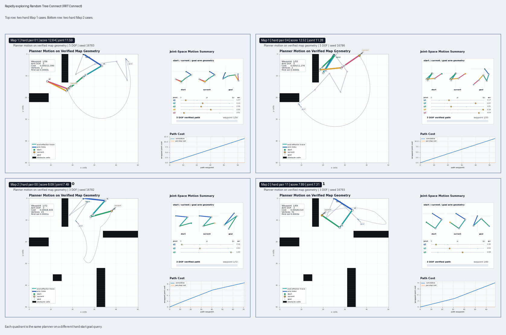
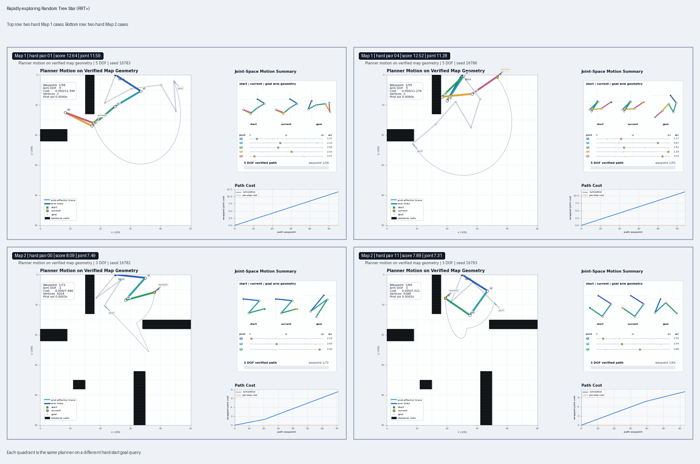
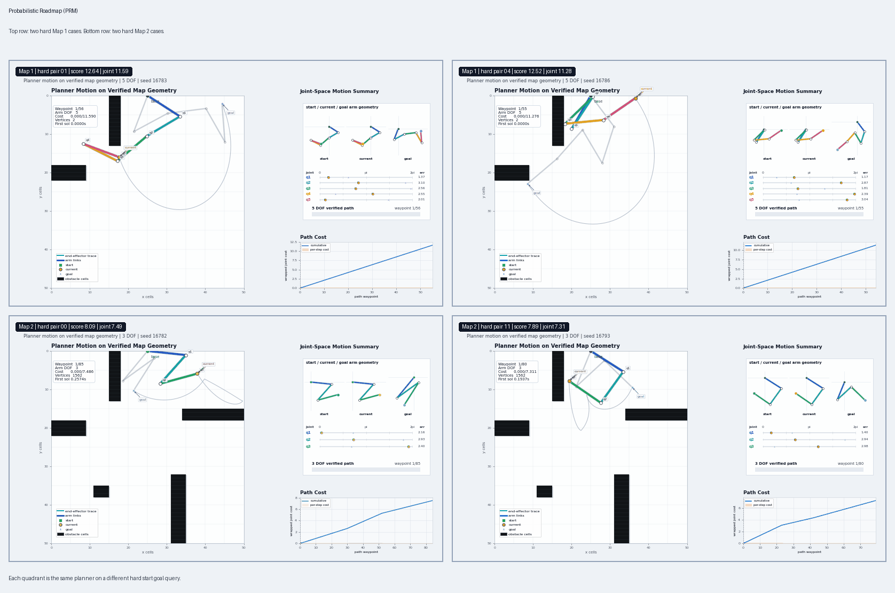
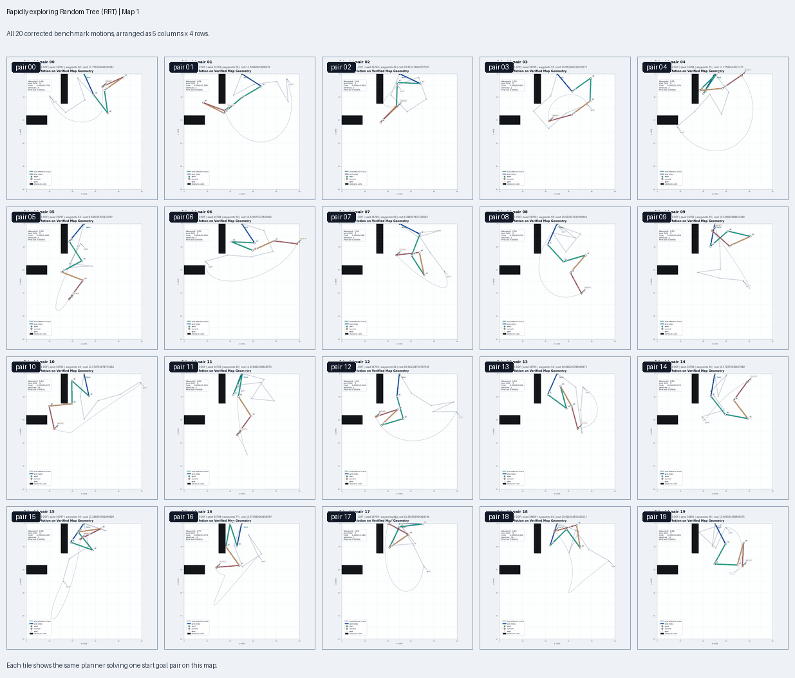
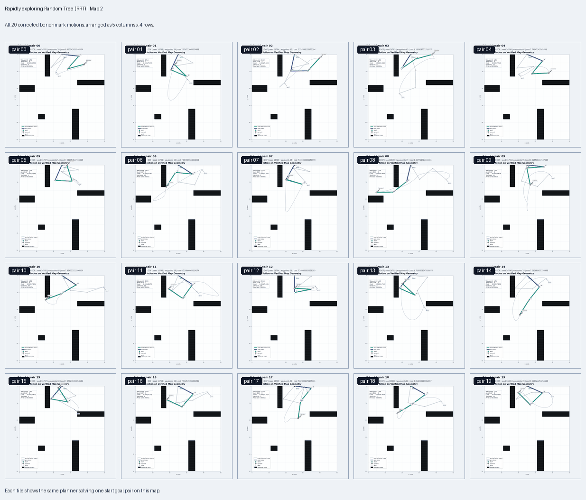
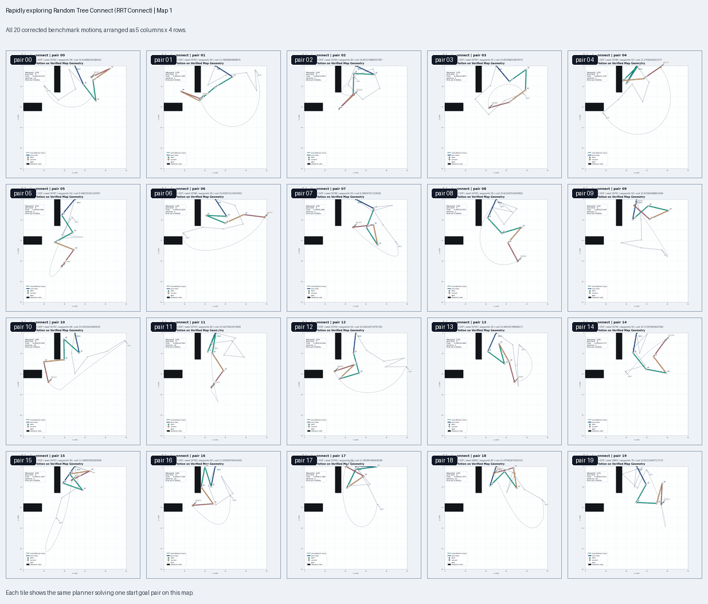
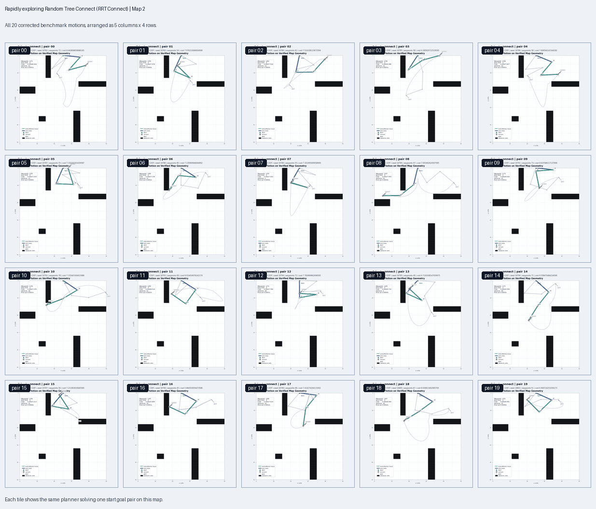
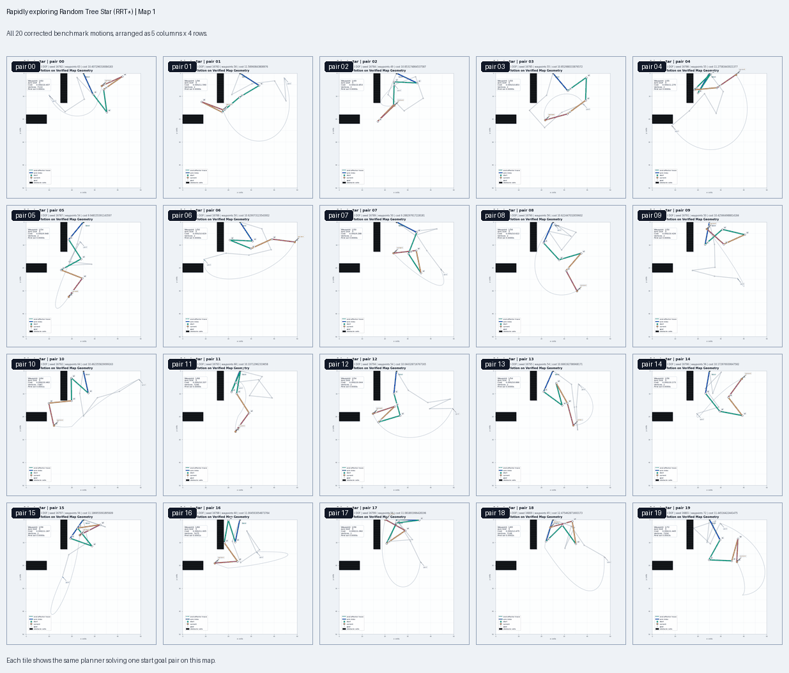
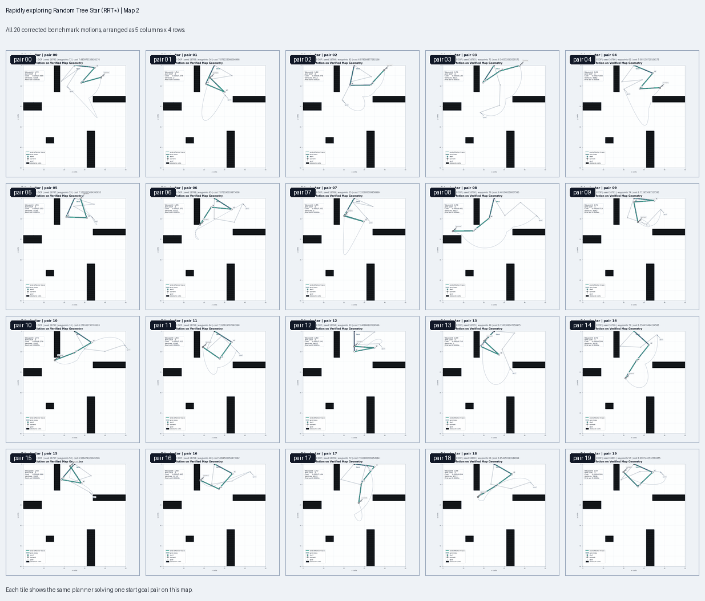
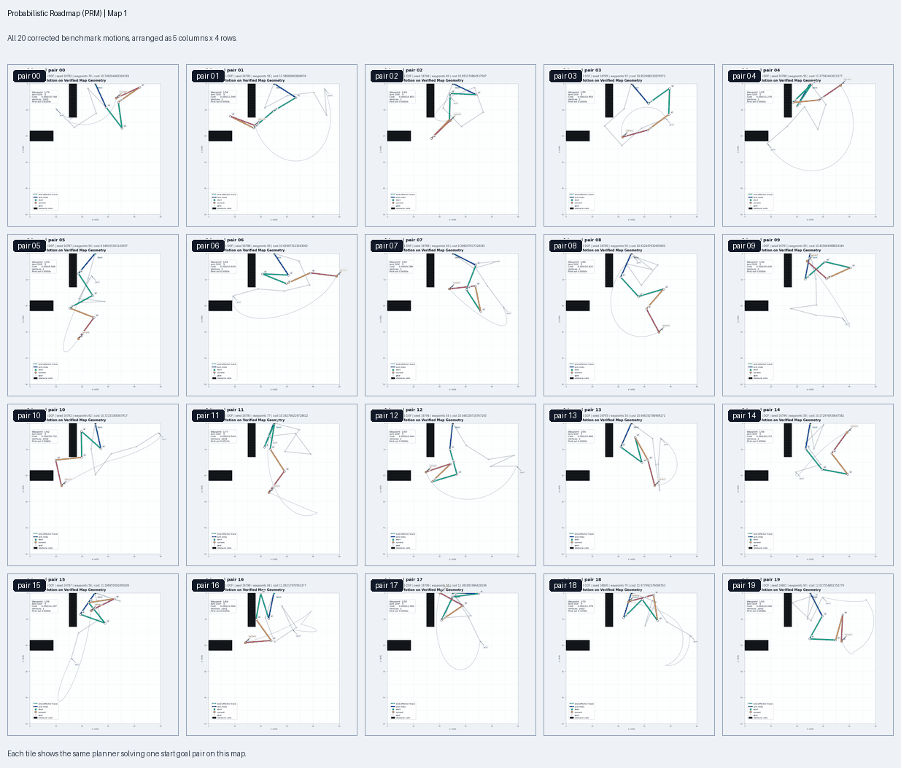

# High DOF Arm Planner

Author: Varun Moparthi

## Abstract

This project builds a complete motion planning system for a planar robotic arm
with many independently actuated joints. The arm operates in a 2D occupancy
grid, where black cells represent walls and every proposed motion must keep every
link of the arm inside free space. A planning query provides the map, the number
of joints, a start configuration, and a goal configuration. The planner returns a
collision free sequence of joint angle configurations that begins at the exact
start state, ends at the exact goal state, and respects the same geometry used by
the verifier and visualizer.

The core challenge is that the robot does not move in ordinary Cartesian space.
Its search space is a wrapped joint angle space, where each angle lives on a
circle and the full arm configuration lies on a high dimensional torus. The
implementation therefore uses wrapped angular distance, resolution controlled
edge checking, forward kinematics, path densification, and shortcut smoothing as
shared foundations across the planner implementations.
## Output Gallery

### Rapidly exploring Random Tree (RRT)


This panel shows the single tree planner on four selected hard motions.

### Rapidly exploring Random Tree Connect (RRT Connect)



This panel shows the bidirectional tree planner on the same selected hard
motions.

### Rapidly exploring Random Tree Star (RRT*)



This panel shows the optimizing tree planner on the selected hard motions.

### Probabilistic Roadmap (PRM)



This panel shows the roadmap planner on the selected hard motions.

## Repository Layout

```text
.
|-- CMakeLists.txt
|-- LICENSE
|-- README.md
|-- include/
|   `-- planners/
|       `-- planner_api.h
|-- maps/
|   |-- map1.txt
|   `-- map2.txt
|-- output/
|   |-- grader_out/
|   |-- report_benchmark/
|   `-- visualizations/
|-- papers/
|   |-- paper.pdf
|   |-- RRT_16782_fall25.pdf
|   |-- probroadmap_16782_fall25.pdf
|   `-- ...
|-- requirements.txt
|-- scripts/
|   |-- benchmark_planners.py
|   |-- build_readme_comparison_gifs.py
|   |-- grader.py
|   |-- render_arm_map_motion.py
|   |-- render_arm_motion_panel.py
|   |-- render_benchmark_visualizations.py
|   `-- visualizer.py
|-- src/
|   |-- planner.cpp
|   |-- verifier.cpp
|   `-- planners/
|       |-- prm.cpp
|       |-- rrt.cpp
|       |-- rrt_connect.cpp
|       `-- rrt_star.cpp
`-- utils/
    |-- planning_common.cpp
    `-- planning_common.h
```

The core executable is `planner`. The companion executable `verifier` checks
saved path files against the same arm configuration validity routine. Shared
sampling, interpolation, angle wrapping, tree operations, roadmap operations,
path densification, smoothing, and planner statistics live in
`utils/planning_common.*`.

## Setup

From the project root:

```bash
cd /mntdatalora/src/High-DOF-Arm-Planner
cmake -S . -B build -DCMAKE_BUILD_TYPE=Release
cmake --build build --config Release
```

Install Python visualization and benchmark dependencies:

```bash
python3 -m pip install --user -r requirements.txt
```

Run one planner manually:

```bash
./build/planner \
  map2.txt \
  3 \
  1.0,2.0,3.0 \
  2.0,3.0,4.0 \
  1 \
  example_path.txt
```

The planner IDs are:

| planner ID | planner name | code key |
| ---: | --- | --- |
| `0` | Rapidly exploring Random Tree (RRT) | `rrt` |
| `1` | Rapidly exploring Random Tree Connect (RRT Connect) | `rrt_connect` |
| `2` | Rapidly exploring Random Tree Star (RRT*) | `rrt_star` |
| `3` | Probabilistic Roadmap (PRM) | `prm` |

The output file is written under `output/` because `OUTPUT_DIR` is compiled into
the binary by CMake.

## Problem Model

### Workspace

Each map is a 2D occupancy grid:

$$
\mathcal{W}=\{(x,y)\mid 0\le x<X,\ 0\le y<Y\}
$$

Each grid cell stores either free space or obstacle space:

$$
M(x,y)\in\{0,1\}
$$

The free workspace is:

$$
\mathcal{W}_{free}=\{(x,y)\in\mathcal{W}\mid M(x,y)=0\}
$$

The map loader, planner, verifier, benchmark sampler, and renderer all use the
same row major visual indexing convention:

$$
idx(x,y)=yX+x
$$

This convention matters because the black wall cells shown in the rendered
visualizations must be the same cells used by collision checking. A path that is
valid only in a transposed map is not a valid path for the visualized problem.

### Arm Configuration Space

For an arm with `n` degrees of freedom, a configuration is a vector of joint
angles:

$$
q=[q_1,q_2,\ldots,q_n]^T
$$

Each angle is periodic:

$$
q_i\equiv q_i+2\pi k,\quad k\in\mathbb{Z}
$$

The implementation normalizes sampled states into:

$$
q_i\in[0,2\pi)
$$

The configuration space is therefore the n dimensional torus:

$$
\mathcal{C}=S^1\times S^1\times\cdots\times S^1
$$

The planner receives exact start and goal arrays from the command line. Internally
it may normalize equivalent angles for planning, but the emitted path is forced
to begin and end with the exact input values:

$$
P_0=q_{start},\quad P_{m-1}=q_{goal}
$$

### Forward Kinematics

The arm base is fixed at the top center of the map:

$$
p_0=(X/2,0)
$$

Every link has length:

$$
L=10
$$

The project convention defines each joint angle as an absolute clockwise
angle from the positive x axis. The endpoint of link `i` is:

$$
p_i=p_{i-1}+L(\cos(2\pi-q_i),-\sin(2\pi-q_i))
$$

Equivalently, if:

$$
p_i=(x_i,y_i)
$$

then:

$$
x_i=x_{i-1}+L\cos(2\pi-q_i)
$$

$$
y_i=y_{i-1}-L\sin(2\pi-q_i)
$$

This is not a relative chain convention where link `i` is rotated by the sum of
previous joint angles. Each link angle is absolute in the map frame. That matches
the provided collision checker and is used consistently by the C++
planner and the Python renderers.

### Collision Checking

A configuration is valid only if every link segment lies inside the map and does
not pass through an occupied cell:

$$
q\in\mathcal{C}_{free}\iff \operatorname{segment}(p_{i-1},p_i)\subset\mathcal{W}_{free},\quad i=1,\ldots,n
$$

The segment test rasterizes each link with a Bresenham style grid traversal. In
implementation terms, the planner checks:

```cpp
IsValidArmConfiguration(q, numofDOFs, map, x_size, y_size)
```

for every sampled vertex and for intermediate states along candidate edges.

### Angular Distance

Because angles wrap at `2*pi`, Euclidean subtraction is not enough. The signed
shortest angular difference from angle `a` to angle `b` is:

$$
\Delta(a,b)=\operatorname{wrap}_{[-\pi,\pi]}(b-a)
$$

The joint space distance used for nearest neighbor search is:

$$
d(q,r)=\sqrt{\sum_{i=1}^{n}\Delta(q_i,r_i)^2}
$$

The maximum per joint displacement used for interpolation resolution is:

$$
d_{\infty}(q,r)=\max_i|\Delta(q_i,r_i)|
$$

The reported path quality cost is the sum of absolute wrapped joint motion:

$$
J(P)=\sum_{k=0}^{m-2}\sum_{i=1}^{n}|\Delta(P_{k,i},P_{k+1,i})|
$$

This cost favors shorter total actuator motion, not necessarily shorter
end effector Cartesian motion.

### Edge Validity

A local edge between two configurations is checked by interpolating on the
shortest wrapped angular arc:

$$
q_i(t)=\operatorname{wrap}(q_i+t\Delta(q_i,r_i)),\quad t\in[0,1]
$$

The number of collision samples along an edge is:

$$
N=\max\left(1,\left\lceil\frac{d_{\infty}(q,r)}{\pi/55}\right\rceil\right)
$$

The edge is valid if:

$$
q(j/N)\in\mathcal{C}_{free},\quad j=0,1,\ldots,N
$$

The same resolution is used again when a sparse planner path is densified for
output. This keeps the verifier friendly path from hiding large jumps between
neighboring waypoints.

## Planner Entrypoint

The command line executable accepts:

```text
./build/planner <mapFile> <numDOFs> <startAngles> <goalAngles> <plannerID> <outputFile>
```

The main flow in `src/planner.cpp` is:

1. Load the map from `maps/<mapFile>`.
2. Parse comma separated start and goal angles.
3. Reject invalid start or goal configurations.
4. Dispatch to the selected planner implementation.
5. Require the returned path to start and end exactly at the input arrays.
6. Write the solution path to `output/<outputFile>`.
7. Optionally write planner statistics when `HDOF_PLANNER_STATS` is set.

The solution file format is:

```text
<absolute map path>
q_1_0,q_1_1,...,
q_2_0,q_2_1,...,
...
```

The trailing comma per line is intentional. It matches the provided scripts
and the supplied verifier workflow.

## Shared Planning Pipeline

All four planners use the same post processing pipeline:

1. Convert exact command line arrays into internal configurations.
2. Normalize internal planning states onto the angular torus.
3. Build a sparse collision free path.
4. Shortcut the sparse path by attempting random long range valid edges.
5. Densify the final sparse path with resolution `pi/55`.
6. Restore exact start and goal values in the emitted plan.

The shortcut smoother repeatedly samples two path indices `a < b`. If the direct
edge between `P_a` and `P_b` is valid, the interior subpath is removed:

$$
[P_0,\ldots,P_a,P_{a+1},\ldots,P_{b-1},P_b,\ldots]\rightarrow[P_0,\ldots,P_a,P_b,\ldots]
$$

This is a pragmatic smoothing step. It does not prove optimality, but it reduces
unnecessary tree or roadmap detours while preserving collision safety because
every replacement edge is checked before being accepted.

## Planner Details

### Rapidly exploring Random Tree (RRT)

Rapidly exploring Random Tree (RRT) grows one tree rooted at the start configuration.
At each iteration it samples a target configuration `q_rand`, finds the nearest
tree node, and extends toward the sample by a bounded step.

The tree is:

$$
T=(V,E),\quad q_{start}\in V
$$

The nearest neighbor is:

$$
q_{near}=\underset{v\in V}{\operatorname{argmin}}\ d(v,q_{rand})
$$

The steering operation is:

If the sample is within one step, the planner uses:

$$
q_{new}=q_{rand},\quad d(q_{near},q_{rand})\le\eta
$$

Otherwise it steers by one step:

$$
q_{new}=\operatorname{interpolate}(q_{near},q_{rand},\eta/d(q_{near},q_{rand}))
$$

The implementation uses:

$$
\eta=0.42
$$

The new node is inserted only when:

$$
\operatorname{edge}(q_{near},q_{new})\subset\mathcal{C}_{free}
$$

The planner also uses a goal bias:

$$
\Pr(q_{rand}=q_{goal})=0.22
$$

All other samples are drawn uniformly from the configuration space:

$$
q_{rand}\sim \operatorname{Uniform}(\mathcal{C})
$$

Goal bias is important in high dimensional spaces because pure uniform sampling
can spend many iterations exploring useful free space without trying to close
the final connection. Once a newly inserted node can connect directly to the
goal, the path is recovered by following parent pointers.

If single tree Rapidly exploring Random Tree (RRT) fails within its time budget,
this implementation falls back to Rapidly exploring Random Tree Connect
(RRT Connect). That fallback is recorded in the stats file.

Map 1 animated GIF panel: single tree Rapidly exploring Random Tree (RRT) expansion and
final arm motion for all 20 corrected `map1` pairs.



Map 2 animated GIF panel: single tree Rapidly exploring Random Tree (RRT) expansion and
final arm motion for all 20 corrected `map2` pairs.



| map | success rate | under 5s rate | avg wall time (s) | avg vertices | avg cost | avg waypoints | fallback count |
| --- | ---: | ---: | ---: | ---: | ---: | ---: | ---: |
| `map1` | 1.00 | 1.00 | 0.0415 | 4.3 | 11.1262 | 58.4 | 0 |
| `map2` | 1.00 | 1.00 | 0.0584 | 14.8 | 7.5417 | 64.5 | 0 |

### Rapidly exploring Random Tree Connect (RRT Connect)

Rapidly exploring Random Tree Connect (RRT Connect) grows two trees:

$$
\operatorname{root}(T_a)=q_{start},\quad \operatorname{root}(T_b)=q_{goal}
$$

Each iteration samples a valid configuration, extends one tree toward the sample,
and then tries to connect the opposite tree all the way to the newly reached
state. The extend step is:

$$
\operatorname{Extend}(T,q_{target})\rightarrow\{TRAPPED,ADVANCED,REACHED\}
$$

The connect step repeatedly applies `Extend` until either an obstacle blocks the
motion or the target is reached:

$$
\operatorname{Connect}(T,q)=REACHED
$$

Otherwise, the connect step returns `TRAPPED`.

The implementation uses:

$$
\eta=0.48
$$

After every iteration, the two trees swap roles. This balances exploration from
both ends and is especially effective when start and goal lie in different
regions connected by a narrow free corridor. When the two trees meet, the final
path is:

$$
P=\operatorname{path}(T_{start},q_{meet})\oplus \operatorname{reverse}(\operatorname{path}(T_{goal},q_{meet}))
$$

Rapidly exploring Random Tree Connect (RRT Connect) is usually the fastest
planner in this project because the two tree connection test aggressively closes
feasible gaps. It is not asymptotically optimal, so it may return a path with
more joint motion than Rapidly exploring Random Tree Star (RRT*) or
Probabilistic Roadmap (PRM).

Map 1 animated GIF panel: bidirectional Rapidly exploring Random Tree Connect (RRT Connect)
motion for all 20 corrected `map1` pairs.



Map 2 animated GIF panel: bidirectional Rapidly exploring Random Tree Connect (RRT Connect)
motion for all 20 corrected `map2` pairs.



| map | success rate | under 5s rate | avg wall time (s) | avg vertices | avg cost | avg waypoints | fallback count |
| --- | ---: | ---: | ---: | ---: | ---: | ---: | ---: |
| `map1` | 1.00 | 1.00 | 0.0351 | 7.8 | 10.8612 | 56.9 | 0 |
| `map2` | 1.00 | 1.00 | 0.0519 | 22.4 | 7.3451 | 64.8 | 0 |

### Rapidly exploring Random Tree Star (RRT*)

Rapidly exploring Random Tree Star (RRT*) modifies Rapidly exploring Random Tree
(RRT) by choosing lower cost parents and rewiring nearby nodes after each
insertion. It keeps the same random exploration idea, but it treats the tree as a
structure that can improve over time.

For a new configuration `q_new`, Rapidly exploring Random Tree Star (RRT*) first
finds nearby nodes:

$$
\operatorname{Near}(q_{new})=\{v\in V\mid d(v,q_{new})\le r_n\}
$$

The radius follows the standard shrinking neighborhood shape:

$$
r_n=\gamma\left(\frac{\log(n+1)}{n}\right)^{1/d}
$$

where `d` is the number of joints. In code this is clamped to avoid a radius
that is too small or too large for the project scale maps:

$$
r_n\in[1.45\eta,1.65]
$$

The parent is selected by minimizing cost to come plus local edge cost:

$$
\operatorname{parent}(q_{new})=\underset{v\in \operatorname{Near}(q_{new})}{\operatorname{argmin}}\left(g(v)+c(v,q_{new})\right)
$$

subject to:

$$
\operatorname{edge}(v,q_{new})\subset\mathcal{C}_{free}
$$

The edge cost is:

$$
c(a,b)=\sum_i|\Delta(a_i,b_i)|
$$

After inserting `q_new`, Rapidly exploring Random Tree Star (RRT*) tries to
rewire each nearby node through the new node:

$$
g(q_{new})+c(q_{new},v)<g(v)
$$

If the inequality holds and the edge is collision free, `v` changes parent. The
cost update is propagated through its subtree.

Once a first solution exists, this implementation biases some samples around the
current best path. A path node is selected, Gaussian angular noise is added, and
the sample is accepted only if it is collision free. That makes later iterations
spend more effort improving the region around an existing solution instead of
uniformly exploring the whole torus.

Rapidly exploring Random Tree Star (RRT*) is slower than Rapidly exploring
Random Tree (RRT) and Rapidly exploring Random Tree Connect (RRT Connect)
because every new node may require many near neighbor edge checks and possible
rewiring. Its advantage is path quality: it often reports the lowest average
joint motion cost in the benchmark.

Map 1 animated GIF panel: Rapidly exploring Random Tree Star (RRT*) improvement over
time for all 20 corrected `map1` pairs.



Map 2 animated GIF panel: Rapidly exploring Random Tree Star (RRT*) improvement over
time for all 20 corrected `map2` pairs.



| map | success rate | under 5s rate | avg wall time (s) | avg vertices | avg cost | avg waypoints | fallback count |
| --- | ---: | ---: | ---: | ---: | ---: | ---: | ---: |
| `map1` | 1.00 | 1.00 | 1.3753 | 2180.2 | 10.7385 | 57.1 | 0 |
| `map2` | 1.00 | 1.00 | 3.8125 | 7667.4 | 6.8666 | 64.5 | 0 |

### Probabilistic Roadmap (PRM)

Probabilistic Roadmap (PRM) builds a roadmap of many valid configurations,
connects nearby configurations with collision free local edges, and then runs
graph search from start to goal. Unlike Rapidly exploring Random Tree (RRT), the
roadmap is not tied to a single query tree shape.

The roadmap is:

$$
G=(V,E)
$$

The initial vertices are:

$$
V=\{q_{start},q_{goal}\}
$$

The sampler then adds valid random configurations:

$$
q\sim \operatorname{Uniform}([0,2\pi)^n),\quad q\in\mathcal{C}_{free}
$$

For each new node, Probabilistic Roadmap (PRM) sorts all other nodes by wrapped
joint space distance and tries to connect the nearest `k` nodes:

$$
N_k(q)=\{v_1,\ldots,v_k\}
$$

An undirected edge is inserted when:

$$
\operatorname{edge}(q,v)\subset\mathcal{C}_{free}
$$

The implementation uses:

$$
k=\max(12,\min(28,6+2n))
$$

The target number of random samples is:

$$
900+220n
$$

After building the roadmap, Probabilistic Roadmap (PRM) runs Dijkstra's
algorithm with edge weights:

$$
w(a,b)=\sum_i|\Delta(a_i,b_i)|
$$

The shortest path satisfies:

$$
P^*=\underset{P:q_{start}\rightarrow q_{goal}}{\operatorname{argmin}}\sum_{(a,b)\in P}w(a,b)
$$

Probabilistic Roadmap (PRM) can produce good paths because it explicitly
optimizes over a graph of many connections. It can be less direct than Rapidly
exploring Random Tree Connect (RRT Connect) on small single query problems
because it spends time constructing a roadmap before the final graph search. When
the roadmap fails to connect start and goal inside the budget, this
implementation falls back to Rapidly exploring Random Tree Connect (RRT Connect).

Map 1 animated GIF panel: Probabilistic Roadmap (PRM) derived arm motion for all
20 corrected `map1` pairs.



Map 2 animated GIF panel: Probabilistic Roadmap (PRM) derived arm motion for all
20 corrected `map2` pairs.


| map | success rate | under 5s rate | avg wall time (s) | avg vertices | avg cost | avg waypoints | fallback count |
| --- | ---: | ---: | ---: | ---: | ---: | ---: | ---: |
| `map1` | 1.00 | 1.00 | 0.2218 | 602.0 | 10.8359 | 60.8 | 0 |
| `map2` | 1.00 | 1.00 | 0.1948 | 1328.0 | 6.9028 | 67.1 | 0 |

## Benchmark Pipeline

The benchmark script is:

```bash
python3 scripts/benchmark_planners.py
```

For each map, it performs the following pipeline:

1. Load the occupancy grid using the same row major convention as the C++ code.
2. Randomly sample candidate start and goal configurations.
3. Reject any pair where either endpoint is in collision.
4. Reject pairs whose wrapped joint distance is below the configured difficulty.
5. Score remaining candidates by joint distance and end effector separation.
6. Keep one hard pair for each seed.
7. Run all four planners on the same 20 pair set.
8. Verify each emitted solution with `build/verifier`.
9. Compute wall time, success, cost, waypoint count, max joint step, and planner
   stats.
10. Write per planner and aggregate CSV/Markdown summaries.

The pair score is:

$$
S(q_s,q_g)=J([q_s,q_g])+0.035\|ee(q_s)-ee(q_g)\|_2
$$

Here `ee(q)` is the end effector position from forward kinematics. The first
term forces large joint space motion. The second term prefers visually and
geometrically meaningful end effector displacement.

The current corrected benchmark set is:

```text
output/report_benchmark/seedset_16782/
```

It contains:

```text
map1/
|-- all_runs.csv
|-- random_pairs.csv
|-- summary.csv
|-- summary.md
|-- prm/
|-- rrt/
|-- rrt_connect/
`-- rrt_star/

map2/
|-- all_runs.csv
|-- random_pairs.csv
|-- summary.csv
|-- summary.md
|-- prm/
|-- rrt/
|-- rrt_connect/
`-- rrt_star/
```

Each planner folder contains `pair_XX_path.txt`, `pair_XX_stats.csv`, and a
planner level `results.csv`.

## Evaluation

The current corrected benchmark was generated with visual wall valid start and
goal pairs. Both maps use 20 fixed random pairs shared across all planners.

### Map 1

`map1.txt` uses 5 DOF problems with a minimum wrapped joint distance of `3.2`.
The generated pairs are intentionally strong: most start goal distances are near
10 to 11 radians of aggregate wrapped joint motion.

| planner | success rate | under 5s rate | avg wall time (s) | avg vertices | avg cost | avg waypoints | fallback count |
| --- | ---: | ---: | ---: | ---: | ---: | ---: | ---: |
| Rapidly exploring Random Tree (RRT) | 1.00 | 1.00 | 0.0415 | 4.3 | 11.1262 | 58.4 | 0 |
| Rapidly exploring Random Tree Connect (RRT Connect) | 1.00 | 1.00 | 0.0351 | 7.8 | 10.8612 | 56.9 | 0 |
| Rapidly exploring Random Tree Star (RRT*) | 1.00 | 1.00 | 1.3753 | 2180.2 | 10.7385 | 57.1 | 0 |
| Probabilistic Roadmap (PRM) | 1.00 | 1.00 | 0.2218 | 602.0 | 10.8359 | 60.8 | 0 |

### Map 2

`map2.txt` uses 3 DOF problems with a minimum wrapped joint distance of `2.4`.
The map has more obstacle cells than `map1`, and the corrected sampler rejects
start and goal configurations that intersect the black visual wall cells.

| planner | success rate | under 5s rate | avg wall time (s) | avg vertices | avg cost | avg waypoints | fallback count |
| --- | ---: | ---: | ---: | ---: | ---: | ---: | ---: |
| Rapidly exploring Random Tree (RRT) | 1.00 | 1.00 | 0.0584 | 14.8 | 7.5417 | 64.5 | 0 |
| Rapidly exploring Random Tree Connect (RRT Connect) | 1.00 | 1.00 | 0.0519 | 22.4 | 7.3451 | 64.8 | 0 |
| Rapidly exploring Random Tree Star (RRT*) | 1.00 | 1.00 | 3.8125 | 7667.4 | 6.8666 | 64.5 | 0 |
| Probabilistic Roadmap (PRM) | 1.00 | 1.00 | 0.1948 | 1328.0 | 6.9028 | 67.1 | 0 |

### Interpretation

Rapidly exploring Random Tree (RRT) and Rapidly exploring Random Tree Connect
(RRT Connect) are the fastest planners. Rapidly exploring Random Tree Connect
(RRT Connect) is especially strong because it expands from both the start and
goal and aggressively attempts to join the two trees. That makes it a good
default when the main objective is to find a feasible path quickly.

Rapidly exploring Random Tree Star (RRT*) is slower because it performs parent
optimization and rewiring. The additional work pays off in lower average path
cost, especially on `map2`, where its average cost is lower than both Rapidly
exploring Random Tree (RRT) and Rapidly exploring Random Tree Connect
(RRT Connect). This is the expected tradeoff: Rapidly exploring Random Tree Star
(RRT*) spends more computation to improve solution quality.

Probabilistic Roadmap (PRM) sits between Rapidly exploring Random Tree Connect
(RRT Connect) and Rapidly exploring Random Tree Star (RRT*) in this benchmark. It
uses more vertices than the basic tree planners, but Dijkstra search on the
roadmap gives strong path quality. Its cost is close to Rapidly exploring Random
Tree Star (RRT*) on `map2` while staying much faster.

## Notes

The build folders and output folders are generated artifacts. The source of
truth for planner behavior is:

```text
src/
include/
utils/
scripts/
maps/
CMakeLists.txt
requirements.txt
```

The `build_stale_oldpath`, `cmake-build-debug`, and `cmake-build-release`
folders may contain stale absolute paths from older environments. Use the
top level `build/` directory regenerated from this project root for current
runs.

## License

This project is released under the [MIT License](LICENSE).

Copyright (c) 2026 Varun Moparthi.
